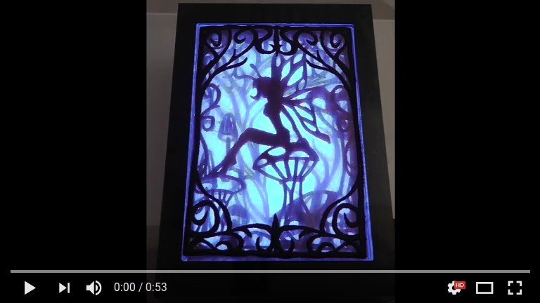
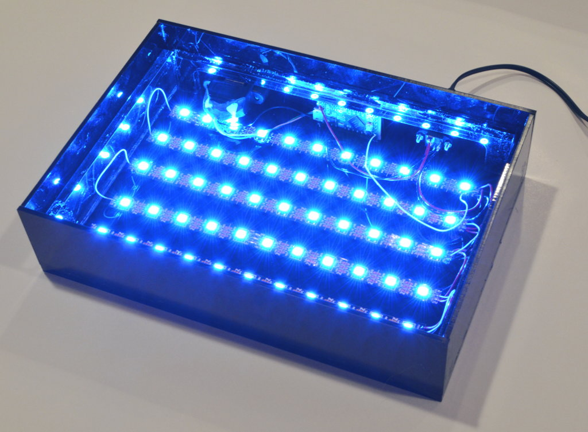

Robin stitched this 4-layer embroidery pattern and assembled this project for a friend's birthday, using laser-cut parts I made, and subtle color & intensity fading LEDs controlled by this code.

Before assembly with the embroidery art:

